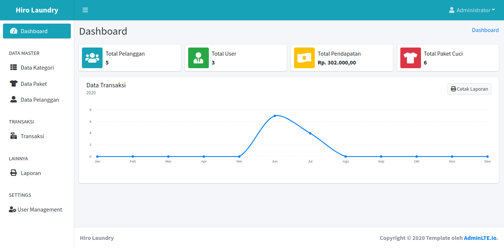

# Laundry_CI3
Application Laundry Cashier Using Codeigniter 3

# Instalation
Create database with name <kbd>ci_laundry</kbd> the import database into the folder <kbd>Database</kbd>. Don't forget settings file<kbd>config.php</kbd>.  
If you have follow step above with true, application should working with correct. 

# User Access
  <b>Admin</b>  
  username : admin  
  pass     :12345

  
# Dashboard Page

